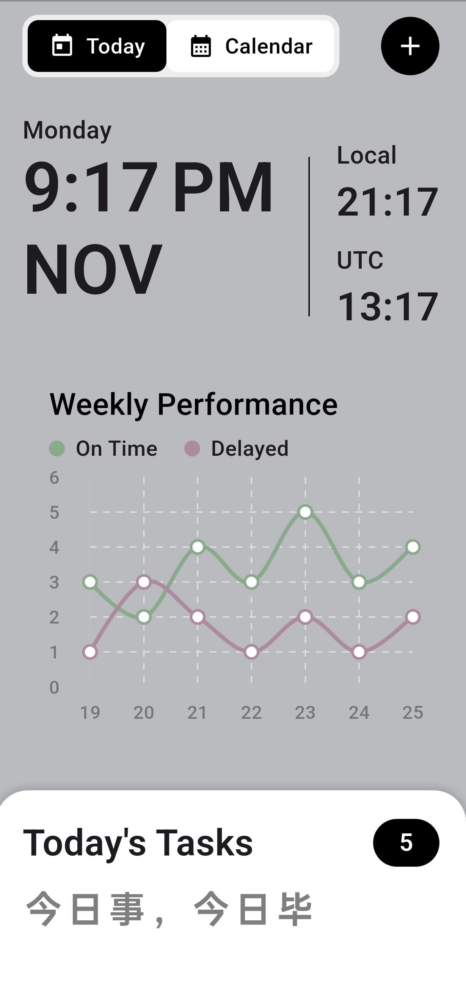
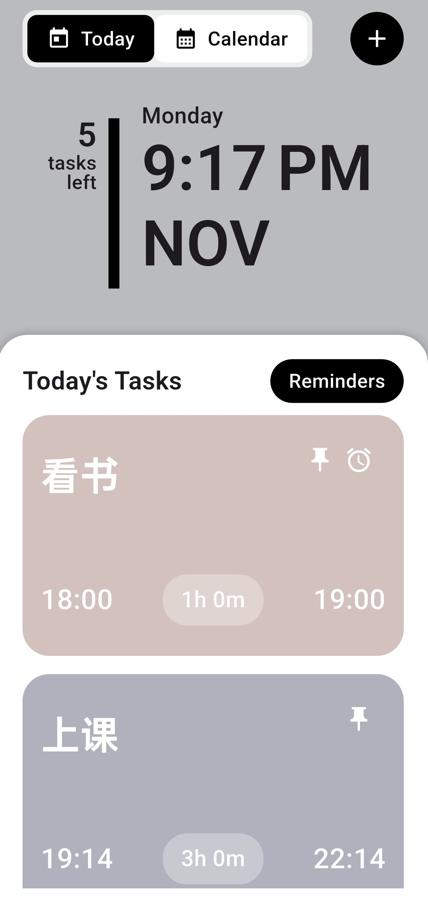
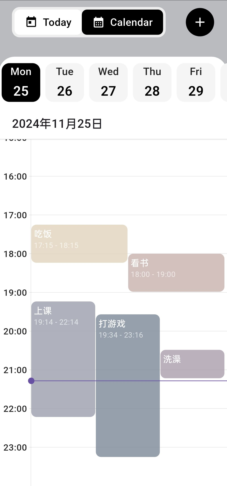

# Chrono - 日历任务管理应用

一个使用 Flutter 开发的简洁日历任务管理应用。
此应用使用cursor开发。

## 截图
<div style="display: flex; justify-content: space-around; align-items: flex-start;">
  <div style="flex: 1; text-align: center; margin: 10px;">
    
    <p><b>今日视图</b></p>
  </div>
  <div style="flex: 1; text-align: center; margin: 10px;">
    
    <p><b>任务编辑</b></p>
  </div>
  <div style="flex: 1; text-align: center; margin: 10px;">
    
    <p><b>日历视图</b></p>
  </div>
</div>

## 功能特点

- 📅 日历视图：支持日视图和今日任务视图切换
- ✏️ 任务管理：
  - 创建、编辑、删除任务
  - 设置任务颜色标记
  - 设置任务时间段
- 💾 数据持久化：使用 SQLite 本地存储任务数据
- 🎨 界面设计：
  - 简洁现代的 UI 设计
  - 流畅的动画效果
  - 支持手势缩放时间轴

## 技术栈

- **框架**: Flutter
- **状态管理**: Provider
- **数据库**: SQLite (sqflite)
- **日历组件**: Syncfusion Flutter Calendar
- **本地化**: intl

## 安装

1. 确保已安装 Flutter 开发环境
2. 克隆项目：
```bash
git clone [项目地址]
```

3. 安装依赖：
```bash
flutter pub get
```

4. 运行应用：
```bash
flutter run
```

## 使用说明

1. **添加任务**：
   - 长按日历空白处
   - 填写任务信息
   - 选择任务颜色
   - 点击保存

2. **编辑任务**：
   - 长按已有任务
   - 修改任务信息
   - 点击保存

3. **删除任务**：
   - 在今日视图中右滑任务卡片

4. **视图切换**：
   - 点击底部导航栏切换视图
## UI灵感来源
@Ruchi Sharma

## 许可证

[MIT License](LICENSE)

